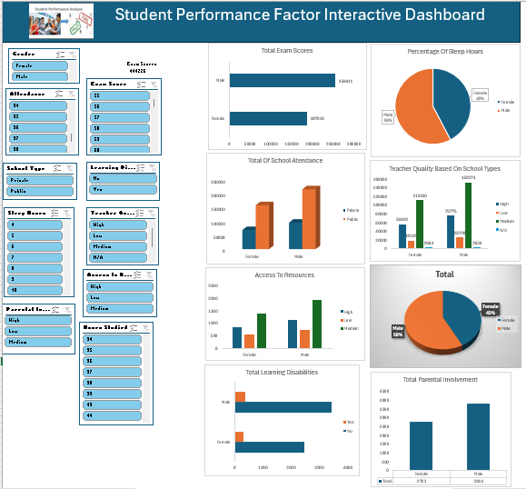

# Project 1
 
**Title:** [Student Performance Factor Interactive Dashboard](https://github.com/Bimboly/Bimboly.github.io/blob/main/Student%20Performance%20Factors%20Dashboard.xlsx)
 
**Tools Used:** Microsoft Excel (Pivot Chart, Pivot tables, Conditional formating, filters, slicers, timelines)
 
**Project Description:** The goal of this project was to identify and analyze various factors influencing student performance. Key factors such as attendance, study hours, parental involvement, and socio-economic status were explored to understand their impact on academic outcomes. The data used for this project was from student records, including performance metrics (Exam Scores), attendance rates, study habits, parental background, and socio-economic factors. 
 
**Key findings:** It was discovered that male Students had higher exam scores compared to female students, a clustered bar chart was used to analyse this finding. It was also discovered that in terms of devoting time to studying out of school lessons, The male students devoted more time to studying compared to the female students, this was analysed using the pie chart which showed Male Students had 58% compared to female students with 42%. It was also discovered that male students had a good attendance in both public and private schools compared to female students in the same type of schools, a clustered column chart was used to display this analysis on the dashboard. It was also discovered that more of the male students utilzed the provided academic resources (Textbooks, Workbooks, e.t.c) in the schools to prepare for exams which gave them good grades compared to the female students, a clustered column chart was used to analyse this. The lifestyle of male and female students was also evaluated in terms of their sleeping habit, parental involvement, and this was analysed using both the pie chart and the stacked column chart. Based on the following explained analysis, the most influential factors on student performance were study hours and attendance. This analysis can inform school policies aimed at improving these areas to enhance overall student outcomes.
 
**Dashboard Overview:**

# Project 2
**Title:** [COVID Project - Data Exploration.sql](https://github.com/Bimboly/Bimboly.github.io/blob/main/COVID%20Project%20-%20Data%20Explorations.sql)
 
**SQL Code:** 
 
**SQL Skills Used:** Joins, CTE's, Temp Tables, Windows Functions, Aggregate Functions, Creating Views, Converting Data Types
 
**Project Description:** The aim of this project is to analyze the relationship between COVID-19 deaths and vaccination rates using structured query language (SQL). This will provide insights into the effectiveness of vaccination programs in reducing fatalities across different regions and time periods. The analysis focus on two primary datasets:
COVID-19 Deaths Table: Contains information on the number of deaths due to COVID-19, categorized by region, age group, gender, and time period.
COVID-19 Vaccination Table: Includes data on the vaccination rates, types of vaccines administered, doses given, and demographic details of the vaccinated population.
 
Project Description:
 
**Technology used:** SQL Server Management Studio 20
